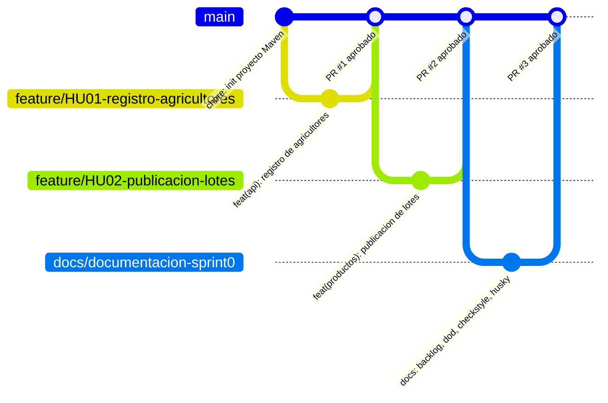

# AgroValle Connect

## Visión del Producto

Para los **productores agrícolas del Valle del Cauca** (Dagua, Palmira, Buga, Tuluá, Caicedonia, Jamundí), que necesitan **vender sus cosechas directamente a comercios urbanos sin intermediación excesiva**, AgroValle Connect es una **aplicación web empresarial (Java 17 / Spring Boot)** que **conecta en tiempo real la oferta agrícola con la demanda comercial de Cali y sus alrededores**, a diferencia de la cadena de comercialización tradicional, que **encarece el producto y perjudica tanto al productor como al comprador final**.

## Integrantes del equipo

- [Juan David Gonzalez] — [rol / correo]
- [Andres Felipe Lopez] — [rol / correo]
- [Nestor Javier Hernandez] — [rol / correo]
- [Steven Andres Guacheta] — [rol / correo]

## Estrategia de ramas

Usamos **Trunk-Based Development con ramas de vida corta** (`feature/*`, `docs/*`), fusionadas directamente a `main` vía Pull Request con revisión de pares. Elegimos este modelo (en lugar de GitFlow) porque el equipo es pequeño (4 integrantes), el proyecto está en una única versión en desarrollo activo, y minimiza el costo de integración manteniendo `main` siempre desplegable.

## Stack técnico

Java 17, Spring Boot, Maven, PostgreSQL.

## Calidad

- Linter: Checkstyle (`checkstyle.xml`)
- Pre-commit hooks: Husky (`.husky/pre-commit`)
- Definition of Done: [`docs/dod.md`](docs/dod.md)
- Backlog del producto: [`BACKLOG.md`](BACKLOG.md)
