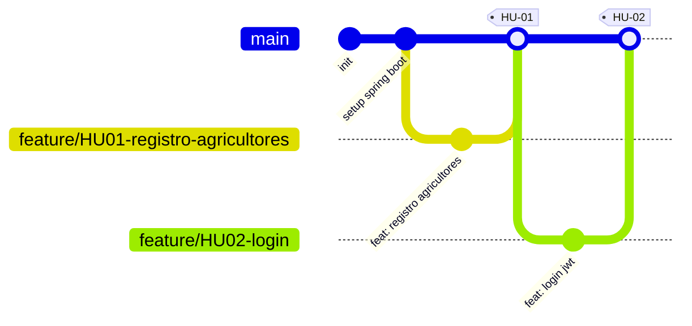

# AgroValle Connect

## Visión del Producto

Para los pequeños y medianos agricultores del Valle del Cauca que necesitan
vender su producción directamente sin intermediarios, AgroValle Connect es
una aplicación web que conecta productores agrícolas con compradores locales.
A diferencia de los canales tradicionales de venta, nuestro producto ofrece
trazabilidad, negociación directa de precios y visibilidad de oferta en
tiempo real.

## Equipo

| Nombre completo         | Usuario de GitHub  | Rol            |
|-------------------------|--------------------|----------------|
| Juan David Gonzalez     | JD8329             | Scrum Master   |
| Steven Andres Guacheta  | Steven-Velez       | Developer      |
| Andres Felipe Lopez     | Felipe-Guinnxh     | Developer      |
| Nestor javier hernandez | Dante-col25        | Developer      |

## Stack Tecnológico

- Java 17
- Spring Boot
- Maven
- PostgreSQL
- JUnit 5 + JaCoCo (cobertura de pruebas)

## Estrategia de Ramas: Trunk-Based Development

Elegimos **Trunk-Based** en lugar de GitFlow porque somos un equipo pequeño
(4 integrantes) trabajando en Sprints cortos, con Historias de Usuario
relativamente independientes. Mantener una sola rama estable (`main`) y
ramas `feature/*` de corta duración reduce la complejidad de gestión de
ramas paralelas (como `develop` o `release` en GitFlow), acelera la
integración continua, y disminuye el riesgo de conflictos grandes por
ramas de larga duración.



## Convenciones de Commits

Usamos [Conventional Commits](https://www.conventionalcommits.org/):
- `feat:` nueva funcionalidad
- `fix:` corrección de errores
- `docs:` documentación
- `test:` pruebas
- `chore:` tareas de configuración

## Cómo ejecutar el proyecto

```bash
./mvnw clean install
./mvnw spring-boot:run
```

Requiere PostgreSQL corriendo localmente con una base de datos `agrovalle_connect`.