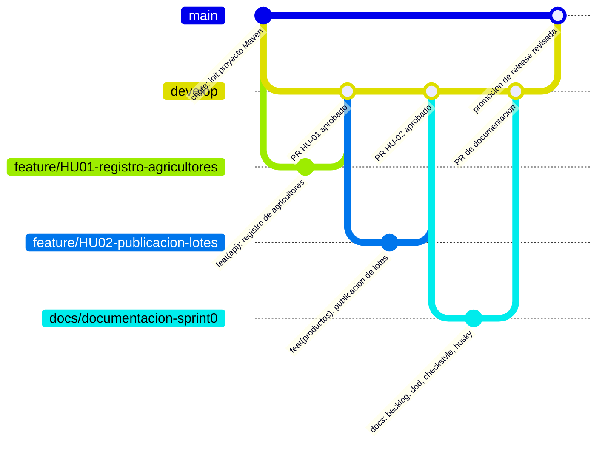

# AgroValle Connect

## Visión del Producto

Para los **productores agrícolas del Valle del Cauca** (Dagua, Palmira, Buga, Tuluá, Caicedonia, Jamundí), que necesitan **vender sus cosechas directamente a comercios urbanos sin intermediación excesiva**, AgroValle Connect es una **aplicación web empresarial (Java 17 / Spring Boot)** que **conecta en tiempo real la oferta agrícola con la demanda comercial de Cali y sus alrededores**, a diferencia de la cadena de comercialización tradicional, que **encarece el producto y perjudica tanto al productor como al comprador final**.

## Integrantes del equipo

- Juan David Gonzalez — Scrum Master
- Steven Andres Guacheta — Developer
- Andres Felipe Lopez — Developer
- Nestor Javier Hernandez — Developer

## Estrategia de ramas

Durante el Sprint 1, el equipo integra ramas cortas `feature/*` a `develop` mediante Pull Requests y revisión de pares; los cambios aprobados se promueven a `main`. El flujo se documenta como ramas de trabajo hacia una rama de integración, no como fusión directa de cada historia a `main`.

```mermaid
gitGraph
   commit id: "chore: init proyecto Maven"
   branch develop
   checkout develop
   branch feature/HU01-registro-agricultores
   checkout feature/HU01-registro-agricultores
   commit id: "feat(api): registro de agricultores"
   checkout develop
   merge feature/HU01-registro-agricultores id: "PR HU-01 aprobado"
   branch feature/HU02-publicacion-lotes
   checkout feature/HU02-publicacion-lotes
   commit id: "feat(productos): publicacion de lotes"
   checkout develop
   merge feature/HU02-publicacion-lotes id: "PR HU-02 aprobado"
   branch docs/documentacion-sprint0
   checkout docs/documentacion-sprint0
   commit id: "docs: backlog, dod, checkstyle, husky"
   checkout develop
   merge docs/documentacion-sprint0 id: "PR de documentacion"
   checkout main
   merge develop id: "promocion de release revisada"
```

## Stack técnico

Java 17, Spring Boot, Maven, PostgreSQL.

## Calidad

- Linter: Checkstyle (`checkstyle.xml`)
- Pre-commit hook: Husky (`.husky/pre-commit`), que ejecuta `./mvnw verify`; ejecutar `npm install` para activar el hook localmente
- Integración continua: GitHub Actions (`.github/workflows/ci.yml`)
- JWT: definir `JWT_SECRET` con al menos 32 bytes antes de iniciar la aplicación; usar un secreto aleatorio fuera de pruebas y no guardarlo en el repositorio
- Definition of Done: [`docs/dod.md`](docs/dod.md)
- Backlog del producto: [`BACKLOG.md`](BACKLOG.md)
- Planificación del Sprint 1: [`docs/sprint-1-planning.md`](docs/sprint-1-planning.md)
- Bitácora de Daily Scrums: [`docs/bitacora-daily-scrum.md`](docs/bitacora-daily-scrum.md)
- Revisión y demo del Sprint: [`docs/sprint-1-review.md`](docs/sprint-1-review.md)
- Retrospectiva del Sprint: [`docs/sprint-1-retrospective.md`](docs/sprint-1-retrospective.md)
