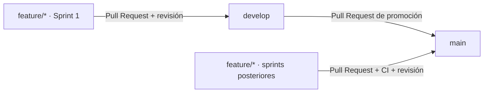

# AgroValle Connect

## Visión del Producto

Para los **productores agrícolas del Valle del Cauca** (Dagua, Palmira, Buga, Tuluá, Caicedonia, Jamundí), que necesitan **vender sus cosechas directamente a comercios urbanos sin intermediación excesiva**, AgroValle Connect es una **aplicación web empresarial (Java 17 / Spring Boot)** que **conecta en tiempo real la oferta agrícola con la demanda comercial de Cali y sus alrededores**, a diferencia de la cadena de comercialización tradicional, que **encarece el producto y perjudica tanto al productor como al comprador final**.

## Integrantes del equipo

- Juan David Gonzalez — Scrum Master
- Steven Andres Guacheta — Developer
- Andres Felipe Lopez — Developer
- Nestor Javier Hernandez — Developer

## Estrategia de ramas

El historial muestra dos etapas: al inicio, las ramas `feature/*` se integraron
en `develop` mediante Pull Requests; en los sprints posteriores, las ramas de
historias se integraron directamente en `main` mediante Pull Requests. El
workflow ejecuta CI para ambos flujos. El diagrama resume ese historial; no
define una política de ramas protegidas.

```mermaid
flowchart LR
    feature1["feature/* · Sprint 1"] -->|"Pull Request + revisión"| develop["develop"]
    develop -->|"Pull Request de promoción"| main["main"]
    featureN["feature/* · sprints posteriores"] -->|"Pull Request + CI + revisión"| main
```

## Stack técnico

Java 17, Spring Boot, Maven, PostgreSQL.

## Calidad

- Guía rápida para iniciar la base de datos, el backend y la interfaz web: [`docs/inicio-facil.md`](docs/inicio-facil.md)
- Linter: Checkstyle (`checkstyle.xml`)
- Pre-commit hook: Husky (`.husky/pre-commit`), que ejecuta `./mvnw verify`; ejecutar `npm install` para activar el hook localmente
- Integración continua: GitHub Actions (`.github/workflows/ci.yml`)
- Staging en Render + Neon y pasos para habilitar el deploy condicionado: [`docs/staging-preproduccion.md`](docs/staging-preproduccion.md)
- JWT: definir `JWT_SECRET` con al menos 32 bytes antes de iniciar la aplicación; usar un secreto aleatorio fuera de pruebas y no guardarlo en el repositorio
- Recuperación de contraseña: configurar SMTP y `PASSWORD_RESET_URL` mediante variables de entorno; ver HU-15 en el [índice de documentación](docs/README.md#sprints)
- Definition of Done: [`docs/dod.md`](docs/dod.md)
- Guía de ejecución y mapa de documentos: [`docs/README.md`](docs/README.md)
- Documentación integral: normalización, prototipos y arquitectura: [`docs/documentacion-integral-agrovalle.md`](docs/documentacion-integral-agrovalle.md)
- Artefactos del Sprint de Diseño: [`docs/diseno/README.md`](docs/diseno/README.md)
- Especificación de requisitos: [`docs/requirements/ieee29148-req01.md`](docs/requirements/ieee29148-req01.md)
- Métricas ágiles: [`docs/metrics/sprint-metrics-corte3.md`](docs/metrics/sprint-metrics-corte3.md)
- Tablero Scrumban y configuración de GitHub: [`docs/scrumban.md`](docs/scrumban.md)
- Backlog del producto: [`BACKLOG.md`](BACKLOG.md)
