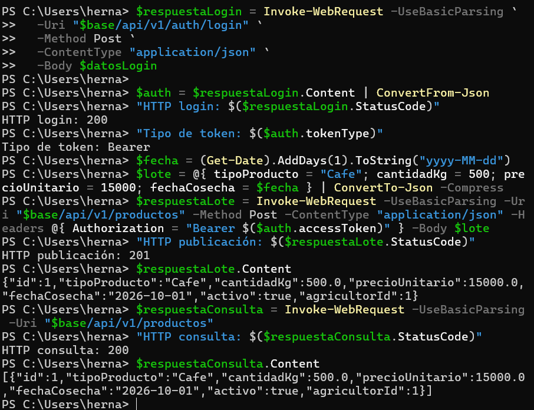

# Revisión y demo del Sprint 1 — AgroValle Connect

## Estado de la revisión

El 30 de septiembre de 2026 se realizó una demo técnica individual, ejecutada por Néstor Javier Hernández Vallecilla. No fue una Sprint Review del equipo ni se registró aceptación de la docente/Product Owner.

| Campo | Registro |
|---|---|
| Fecha de la demo | 30/09/2026 |
| Participante y presentador | Néstor Javier Hernández Vallecilla |
| Tipo | Demo técnica individual |
| Historias comprobadas | HU-01 (cuenta registrada e inicio de sesión) y HU-02 (publicación y consulta de lote) |
| Evidencia | [Captura de la demo técnica individual](evidencias/demo-tecnica-individual.png) |
| Aceptación de la docente/Product Owner | No registrada |

## Evidencia técnica automatizada

La ejecución de GitHub Actions del PR #21 ejecutó `clean verify` y finalizó con éxito. El log registra:

- 12 pruebas aprobadas, sin fallos ni errores.
- Cero violaciones de Checkstyle.
- Umbral de cobertura JaCoCo cumplido.
- `BUILD SUCCESS`.

[Ver ejecución de CI](https://github.com/JD8329/Ingenieria-de-software-2/actions/runs/36589475210). Esta evidencia corresponde a pruebas automatizadas; no sustituye la demo manual ni acredita aceptación de la docente/Product Owner.

El PR #21 fue fusionado en `main` el 29 de septiembre de 2026. GitHub no registra aprobaciones formales de revisión para ese PR.

## Resultados observados en la demo técnica individual

| Escenario | Resultado observado | Evidencia | Comentarios de interesados |
|---|---|---|---|
| Registro de agricultor | El reintento informó que ya existía un agricultor con ese correo. El código HTTP del primer intento no quedó registrado. | Salida de PowerShell | No registrados |
| Login JWT | HTTP 200; tipo de token `Bearer` | Salida de PowerShell | No registrados |
| Publicación autenticada | HTTP 201; lote creado con ID 1 | [Captura de la demo técnica individual](evidencias/demo-tecnica-individual.png) | No registrados |
| Consulta de lotes | HTTP 200; se recuperó el lote creado | [Captura de la demo técnica individual](evidencias/demo-tecnica-individual.png) | No registrados |
| Protección de datos de la respuesta del lote | La respuesta mostró los campos del lote y `agricultorId`, sin correo, cédula ni contraseña | [Captura de la demo técnica individual](evidencias/demo-tecnica-individual.png) | No registrados |

No se registran aquí resultados de publicación sin token ni de validaciones con datos inválidos: esos escenarios constan en las pruebas automatizadas, pero no se ejecutaron durante esta demo manual.

## Pendiente de completar

- Registrar comentarios o aceptación de la docente/Product Owner únicamente si se reciben.
- Registrar acciones de seguimiento cuando sean acordadas.
